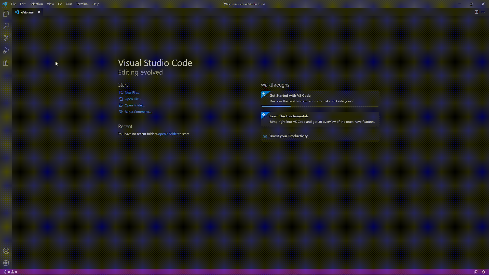
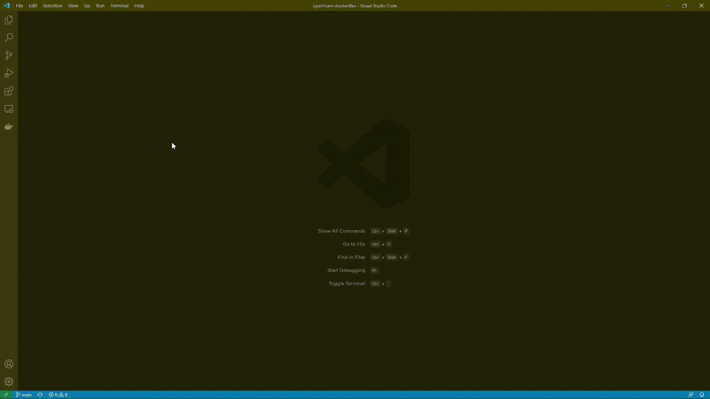
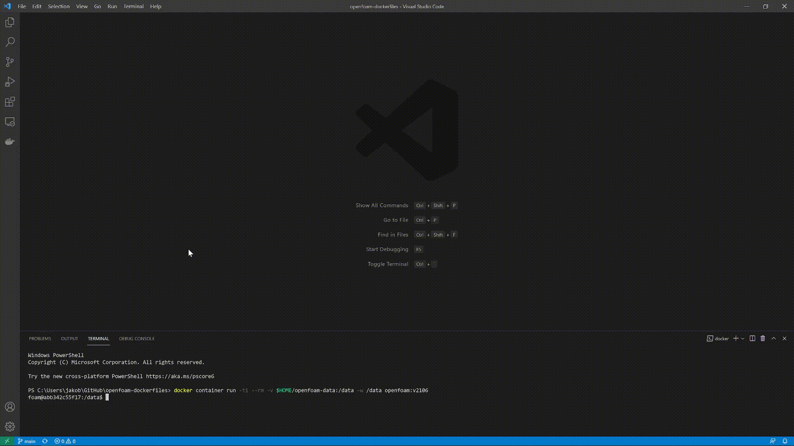
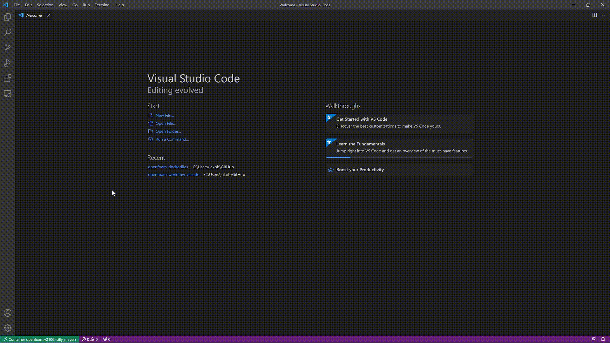
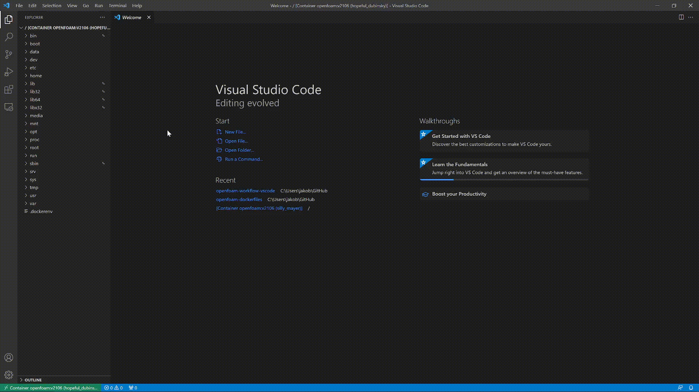

## 1. Prerequisites
*1a)* Install [Docker](https://www.docker.com/products/docker-desktop)

Windows only: You will be prompted to install WSL (Windows Subsystem for Linux) when installing Docker (in the instructions
please follow step 4 and 5).

*1b)* Install [Git](https://git-scm.com/downloads) for your operating system (Windows, macOS or Linux)

*1c)* Install the latest [Paraview](https://www.paraview.org/download/) version. Feel free to choose the MPI versions, which let's you run Paraview in parallel. 

Windows only: Choose the .exe file

macOS: Choose the .pkg file

Linux: Choose the .tar.gz archieve and extract it

*1d)* Install [Visual Studio Code](https://code.visualstudio.com)

## 2. Preparing for OpenFOAM
*2a)* Open a Powershell (Windows) or a terminal (macOS or Linux) and run the following commands. First, we make a folder to store your OpenFOAM data:

```shell
mkdir $HOME/openfoam-data
```

*2b)* Next, clone this repository by:

```shell
git clone https://github.com/OpenSourceCFDCourse/openfoam-dockerfiles.git $HOME/openfoam-dockerfiles
```

You should now have two folder "openfoam-data" and "openfoam-dockerfiles" in your home folder.

*2c)* Now, open Docker Desktop and keep it open in the background before continuing.

*2d)* Build the OpenFOAM image:

```shell
docker image build -t openfoam:2112 $HOME/openfoam-dockerfiles/2112/
```

## 3. Run the Docker container

*3a)* Finally, start a Docker container with ``/data`` mapped to ``$HOME/openfoam-data``:

```shell
docker container run -ti --rm -v $HOME/openfoam-data:/data -w /data openfoam:2112
```

*Please note* that everything in the container is deleted when you exit the container. Therefore you should save your simulation results and solver development in ``/data``, which is the only directory that persists when the container is closed.

Running the above command should leave you inside the Docker container with the username "foam". 
Also, you may access the container through ``$HOME/openfoam-data`` e.g.:

On a Windows system: ``C:\Users\jakob\openfoam-data``

On a macOS system: ``/Users/jakob/openfoam-data``

On most Linux systems: ``/home/jakob/openfoam-data``

## 4. Optional Save an alias for running the Docker container
Instead of using the command in docker container with the command in [3. Run the Docker container](#3-run-the-docker-container), we can save an alias for that command. So when you open a Powershell (Windows) or a terminal (macOS or Linux) you can simply type ```of2112``` to start the Docker container.

### **Windows operating system**
*4a)* Open a Powershell with Administrator Rights and enter the follwing commands (copy/paste).

*4b)* Allow scripts to be run:
```shell
Set-ExecutionPolicy RemoteSigned
```

*4c)* Create a ```profile``` file to store our alias function:
```shell
New-Item -Path $profile -ItemType file -force
```

*4d)* Add the alias to the newly created file (copy/paste the following into the Powershell):
```shell
echo "function fcn-2112 {
  docker container run -ti --rm -v $HOME/openfoam-data:/data -w /data openfoam:2112
  }
Set-Alias of2112 fcn-2112
" > $profile
```

*4e)* Close and re-open the Powershell

*4f)* To run a Docker container you can now type:
```shell
of2112
```

### **macOS and Linux systems**
*4a)* 
Copy/paste the following in the terminal:
```shell
case "$OSTYPE" in
  linux*)   echo "alias of2112='docker container run -ti --rm -v $HOME/openfoam-data:/data -w /data openfoam:2112'" >> $HOME/.bashrc ;;
  darwin*)  echo "alias of2112='docker container run -ti --rm -v $HOME/openfoam-data:/data -w /data openfoam:2112'" >> $HOME/.zprofile ;;
  *)        echo "This function is not yet added for $OSTYPE" ;;
esac
```

*4b)* Close and re-open the Terminal

*4c)* To run a Docker container you can now type:
```shell
of2112
```

## 5. Setup Visual Studio Code for OpenFOAM
*5a)* Open Visual Studio Code and follow the steps outlined below.

*5b)* Install the following extensions, which will help our OpenFOAM workflow:
1. *Docker*
2. *Remote - Containers*
3. *OpenFOAM*



## 6. Associate OpenFOAM-specific files to enable syntax highlighting

*6a)* Associate file extensions for OpenFOAM syntax highlighting.


## 7. Start Docker container

*7a)* Maks sure Docker Desktop is running in the background.

*7b)* Start a Powershell or terminal in VS Code and run the following command to start a Docker container (or use the ```of2112``` alias):

```shell
docker container run -ti --rm -v $HOME/openfoam-data:/data -w /data openfoam:v2112
```



Note: If you followed step [4. Optional Save an alias for running the Docker container](#4-optional-save-an-alias-for-running-the-docker-container), you can simply use the alias:
```shell
of2112
```

## 8. Attach Visual Studio Code to the running Docker container
*8a)* Attach Visual Studio Code to the running Docker container. This enables us to access the file system within the container directly in VS Code.



## 9. Open a folder to access the file system within the Docker container
*9a)* From within the newly opened window open a folder at root ``/`` to gain full access to the file system of the Docker container.



## 10. Open a terminal from within the Docker container
*10a)* Open a new terminal within the Docker container and test if OpenFOAM is sourced correctly:
```shell
simpleFoam -help
```


## 11. Installing new extensions
We will be using different extensions in the two courses. 

*5a)* To extend our Docker image to include a Python installation with different useful packages:

```shell
docker image build -t openfoam:2112 $HOME/openfoam-dockerfiles/python
```

*5b)* To extend our Docker image to include a FreeCad installation:

```shell
docker image build -t openfoam:2112 $HOME/openfoam-dockerfiles/freecad
```

## 12. Author list

Jakob Hærvig
Johan Rønby
Niels Linnemann Nielsen